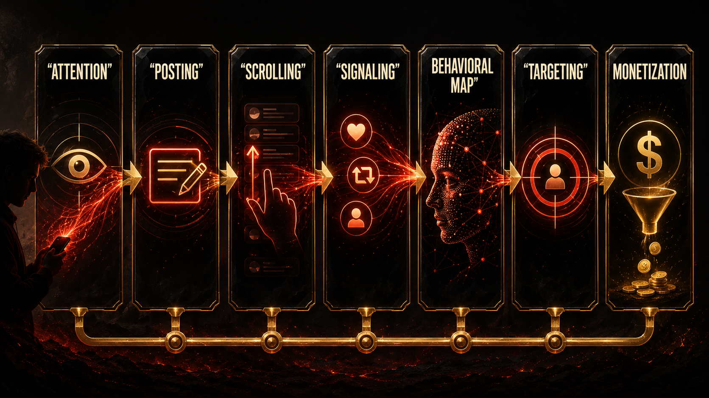
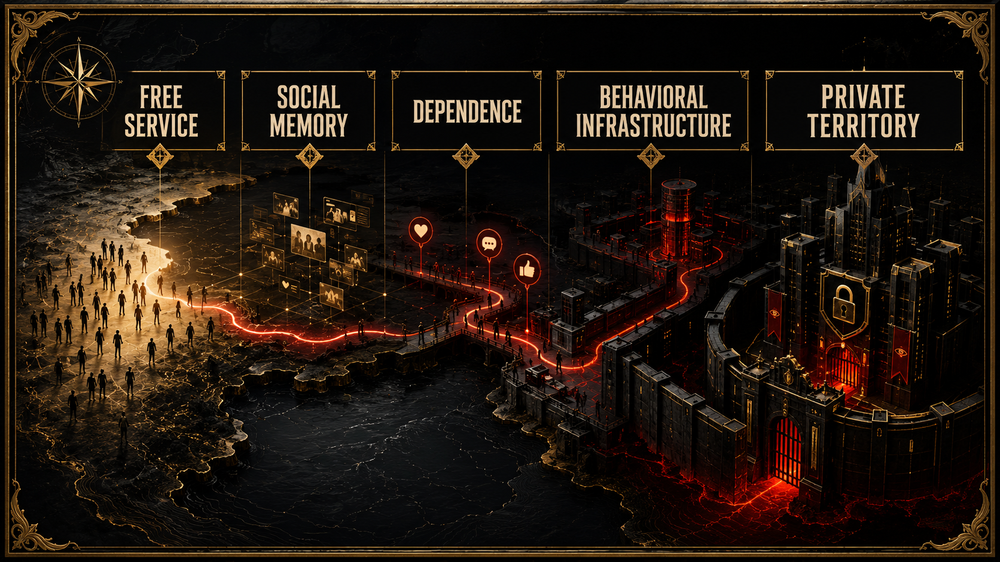

# The Free Trap

## Deck

How the platforms taught us to confuse participation with payment while they harvested the map of our behavior.

## Opening

The product was never the app.

The product was the behavioral map.

That line lands harder now because the innocence is gone. But a lot of us really did not see it at first. The apps felt like atmosphere. You joined because everyone else was already there. Your crush was there. Your friends were there. Your school gossip was there. Your scene was there. Your future clients were there. Your family was there. Your ex was definitely there. The platform did not feel like a product you were purchasing. It felt like a place you had to enter if you wanted to remain socially visible.

That is the first trick.

If something becomes the place where life happens, most people stop asking what the rent is.

## Main Narrative

The early promise was almost offensively seductive. Free connection. Free publishing. Free reach. Free self-expression. Free audience. Free identity at scale. The phone in your pocket became a tiny kingdom where you could flirt, flex, market yourself, stalk old classmates, build a brand, document your life, and get just enough validation to come back tomorrow.

What people were not trained to see was that every one of those verbs also had a shadow verb attached to it.

Post meant disclose.

Scroll meant reveal.

Pause meant signal.

Share meant classify.

Delete meant signal too.

Every tiny movement clarified preference. Every preference sharpened prediction. Every prediction improved monetization.

The beauty of the model, if you are viewing it from the side of capital, is that users were never told to think of themselves as workers. That would have sounded ridiculous. Workers expect wages. Users expect features. So the labor of training the behavioral map was smuggled into the culture as participation, performance, and fun.

This matters because it changes the politics of consent. If you think you are being entertained, you are less likely to see yourself as producing surplus. If you think the price is zero, you are less likely to ask what exactly the company is accumulating in the background. If the feedback loop is emotional instead of monetary, the extraction can feel intimate instead of industrial.

That is why a platform like Facebook matters in this story even when the story is much larger than Facebook. It was not only one company. It was a prototype for a whole way of governing life through identity, surveillance, ranking, and monetized social dependence. It helped teach the market that the most valuable map in history might be the live map of human behavior.

Not just what people say they like.

What they stop on.

What they stalk.

What makes them jealous.

What makes them insecure.

What time they are weakest.

What tone makes them buy.

What outrage keeps them awake.

That is a different order of knowledge than old advertising ever had. It is less like placing a billboard and more like building a behavioral observatory attached to everyday life.

And once you understand that, the word free starts sounding almost sarcastic.

Free for whom?

Free at which layer?

Free in price, maybe.

Not free in sovereignty.

Not free in privacy.

Not free in autonomy.

Not free in psychic cost.

Not free in the long-term transfer of power from public social life to private systems that own identity, visibility, and memory.

That is what the strongest regulatory record clarifies. The issue is not merely that platforms collected data in a generic sense. Of course they collected data. The deeper problem is that social interaction itself became the extraction engine. The richer the social experience, the richer the commercial map. The more personal the environment, the more valuable the surveillance layer.

That is why so much of the damage was misnamed for so long. People talked about distraction. Or privacy. Or online drama. Or screen time. Those are real issues, but they do not fully capture the scale of what got built. A better phrase would be behavioral infrastructure. These companies did not just host content. They built systems that could continuously observe, rank, predict, and shape the conditions under which content and people encountered each other.

That is a power problem, not just a product problem.

It also explains why leaving is not simple. The user in a technofeudal system is formally free, but practically dependent. You can leave the land, sure. But your people are there. Your attention economy is there. Your audience is there. Your soft professional capital is there. Your social memory is there. Your visibility is there. Departure is legally possible and culturally expensive.

That is serf logic with better UX.

Anyone who has ever tried to step back already knows the feeling. You delete the app and suddenly the social map gets grainy. The birthday invite was in the story. The industry joke was in the group chat. The niche opportunity was in the DM request you were not supposed to care about but definitely cared about. Your friends say, “just text me,” but the culture has already been routed elsewhere. The feed is not merely where people waste time. It is where time got socially organized. That is why refusal can feel weirdly aristocratic, like only people with unusual confidence, money, local community, or stable status can afford to be offline for real.

That dependency is one of the cleanest signs that we are not talking about an app market in the ordinary sense. We are talking about privately owned territory dressed up as convenience. When social participation, cultural visibility, and soft economic opportunity all stack on the same interface layer, the choice to “just leave” starts sounding like telling a tenant to “just move” in a city where one landlord quietly bought the whole neighborhood.

That is also why this chapter needs a market image, not only a psychology image. A supermarket does not need to grow the tomato to dominate the farmer. It needs to own the shelf people have to pass through. Once the intermediary controls visibility, traffic, and access, it can start shaping value without producing the underlying life of the system. Platforms pulled off the social version of that trick before AI ever pulled off the cognitive one.

And it gets even darker when you realize the platform does not have to hate you to exploit you. That is one of the reasons this book resists cheap conspiracy language. The system does not need a villain monologue. It only needs a model that rewards extraction. Once the incentive structure is in place, the rest becomes operational culture.

Grow.

Capture.

Retain.

Target.

Monetize.

Optimize.

Repeat.

The app keeps smiling while the map gets deeper.

And because the culture normalized all of this during the rise of social media, the later move into AI felt much less shocking than it should have. By then, billions of people had already been trained to surrender intimate expression in exchange for convenience, visibility, and ambient belonging. The harvest was already happening. The public just did not call it harvest.

That is why the free trap is not a nostalgia chapter. It is the foundation chapter. If modern life had not already been privatized into platforms, the later enclosure of intelligence would have looked more absurd. The bridge from social media to AI is not a weird leap. It is almost painfully direct. First the platforms map human behavior. Then the archive becomes training material. Then the outputs return to society as synthetic assistants, search layers, reasoning tools, and replacement pressure.

The continuity is brutal once you see it.

We thought we were building profiles.

We were building the field.

We thought we were networking.

We were feeding instrumentation.

We thought the app was a product.

The real product was a persistent, scalable model of us.

And that is the point where the passive-intermediary story starts to fall apart. A system that ranks exposure, tunes visibility, nudges desire, profiles weakness, and monetizes emotional response is not just a neutral wall on which strangers happen to speak. It is an active environment. A governed environment. A behavioral landlord.

That shift matters for the reforms waiting at the end of this book. Because if sovereign-scale platforms are really behavioral infrastructure, then legal frameworks built around the fantasy of passivity start looking obsolete on contact. You cannot keep giving feudal power the liability profile of a bulletin board.

But before law catches up, culture has to catch up.

And culture still needs a cleaner sentence than most public debate offers.

Here it is:

The feed did not go wrong by accident.

The feed was profitable because it turned human life into observability.

Everything after that follows from the same design logic.

## Research Basis

This chapter adapts the documentary argument developed in the research paper [**Chapter 01: Social Networks as Infrastructure for Free Data Capture**](../../papers/html/01_social-networks-data-capture_paper.html). The PDF version is [here](../../papers/pdf/01_social-networks-data-capture_paper/01_social-networks-data-capture_paper.pdf). That paper grounds the case in the FTC record, Facebook/Meta governance history, and the platform business model of persistent extraction.

## Next

Once behavior can be captured, it can also be steered. The next chapter leaves surveillance behind and moves into the psychic bill: what it feels like to grow up inside systems that learn which forms of insecurity keep us watching.
