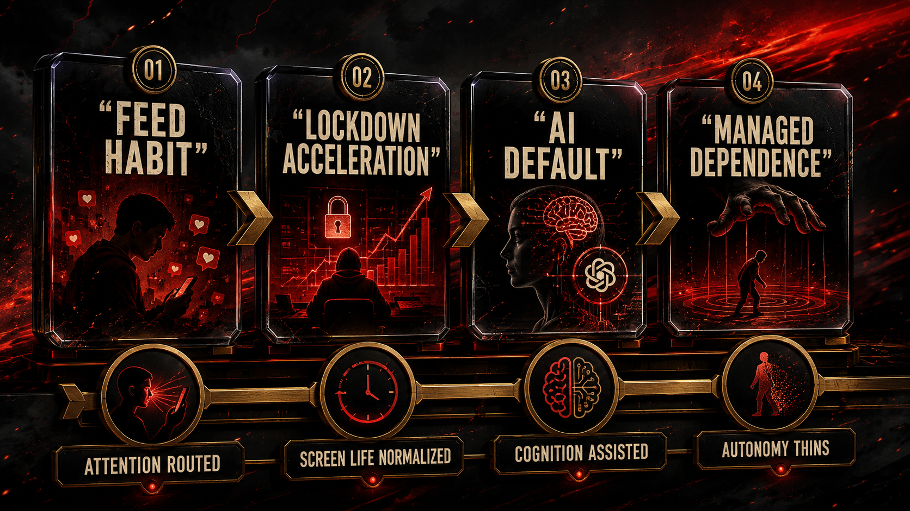
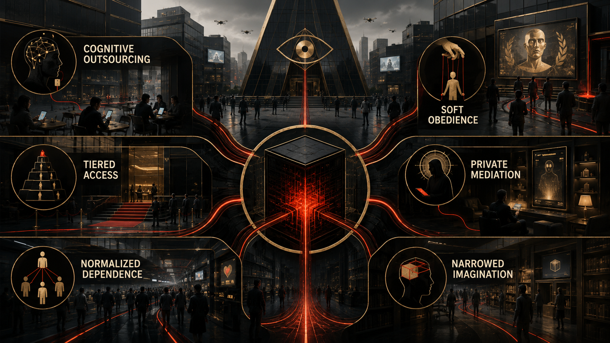

# If No One Acts

## Deck

What comes next if dependence, enclosure, and state-corporate fusion harden into infrastructure.

## Opening

The most believable nightmare is not a robot apocalypse.

It is a flatter, quieter world.

A world where judgment weakens by convenience.

Where labor softens by attrition.

Where attention never fully comes back.

Where more and more people rely on systems they do not govern, do not meaningfully audit, and cannot realistically refuse without losing social, cultural, or economic ground.

That future does not arrive with laser eyes and a dramatic soundtrack.

It arrives through continuity.

## Main Narrative

Continuity is dangerous because it never sounds as intense as rupture, even when it changes life more deeply. A lot of people are waiting for a single dramatic moment that proves the age has tipped. But most structural losses do not look like that in real time. They look like one more workflow moving into the model layer. One more institution outsourcing judgment. One more generation learning that stillness feels unbearable. One more labor pool told to adapt downward. One more public body leaning on private intelligence infrastructure because it is easier than building sovereign alternatives.

Nobody stands at a podium and announces: today we outsource a little more memory, a little more authorship, a little more confidence, a little more focus. The transfer happens through convenience, through repetition, through the low-friction seduction of never having to sit with difficulty for very long.

That is how sovereignty thins.

Not with one speech.

With repetition.

If no one acts, the social order described in the earlier chapters does not need to become science fiction to become intolerable. It only needs to keep consolidating. Young people remain raised inside recommendation systems that know how to monetize restlessness. The archive remains privately enclosed into model capability. The technical middle class remains easier to discipline because automation theater weakens leverage. Governments remain increasingly entangled with the same firms they are supposed to regulate. The public remains cognitively tired enough to confuse access with power and convenience with legitimacy.

In that world, inequality becomes more than economic.

It becomes cognitive.

Some actors will buy privileged proximity to the frontier.

Some states will negotiate sovereign access.

Some companies will sit inside the stack where rules are made.

Some universities and institutions will orbit the prestige field.

Some elites will also buy fallback itself: backup land, hardened compounds, offshore legal options, redundant energy, private security, the ability to leave a breaking system while everyone else is told to keep trusting it.

And everyone else will be told that they still live in an open society because there is a consumer interface somewhere in the chain.

That is not democratization.

That is tiered intelligence wrapped in mass-market UX, with tiered survivability waiting behind it.

The danger is especially sharp for the generations already shaped by the feed. A reader who spent adolescence inside algorithmic ranking may spend adulthood inside model-mediated cognition. First the system fragments attention. Then it offers synthetic assistance for the very forms of concentration it helped erode. First it industrializes comparison. Then it offers soothing machine counsel. First it captures the archive. Then it licenses pieces of thought back as premium functionality.

That loop is not futuristic.

It is already here in embryo.

What changes in the continuity scenario is scale and normalization.

The user stops noticing how much internal life has been externalized because externalization becomes ordinary. Memory goes out. Drafting goes out. Search judgment goes out. Interpretation goes out. Taste sometimes goes out. Administrative reasoning goes out. Small acts of thought become increasingly scaffolded by systems whose ownership and obligations remain private and strategic.

Some assistance is genuinely helpful.

That is not the issue.

The issue is what happens when helpfulness scales without democratic control.

What happens when whole populations become dependent on machine-mediated cognition while the governance of that cognition remains concentrated.

What happens when the tools that mediate thought are also bound up with state access, labor discipline, and surveillance-era business models.

That is the continuity risk.

Not Skynet.

A slower civic downgrading.

A cultural atmosphere of permanent managed dependence.

A society that becomes less practiced at judgment while being told it has never had more intelligence at its fingertips.

This future also reshapes ambition in subtle ways. If the model becomes the default drafting partner, research assistant, planning engine, and interface to knowledge, then the human relationship to difficulty may change too. Some friction disappears in good ways. Some friction disappears in ways that flatten patience, intellectual ownership, and the slow confidence that comes from wrestling something into clarity yourself. A generation already trained by the feed to expect immediate stimulation may be further trained by the model to expect immediate cognitive support.

That is not universal doom.

But it is a civilizational tradeoff.

And one of the cruelest parts of the continuity scenario is that it can feel subjectively comfortable while remaining politically degrading. Many people may genuinely like parts of it. Faster writing. Easier coding. Less blank-page pain. More responsive search. More ambient guidance. That is what makes the structure hard to confront. Domination that also delivers convenience can become sticky fast.

Older political vocabularies still struggle with that. People are used to imagining domination as obviously violent, visibly hated, impossible to mistake for help. But digital dependence often arrives padded, personalized, almost caring in tone. It says: let me help. Let me draft that. Let me remember. Let me suggest the better phrasing. Let me make the hard part less lonely. And because modern life already exhausts people, that kind of domination can feel merciful before its costs are fully legible.

If no one acts, the public language around freedom may shrink without admitting it. Freedom will increasingly mean choosing among interfaces inside a hierarchy you do not govern. Creativity will increasingly mean working alongside systems trained on collective culture but owned through narrow channels. Work will increasingly mean competing beside machines invoked as both helpers and threats. Public reasoning will increasingly occur in environments mediated by the same model infrastructures whose politics remain opaque to most users.

The nightmare is not dramatic enough for movies.

It is real enough for policy.

It is intimate enough for daily life.

And it is already legible enough that neutrality starts looking like surrender.

There is also a risk that the social imagination itself narrows. Once enough people internalize the idea that intelligence is now something primarily accessed through private model layers, they may stop expecting public alternatives altogether. That is how enclosure wins twice. First materially, by controlling the infrastructure. Then psychologically, by shrinking what the public can even picture as realistic. The future starts sounding like a menu of proprietary options rather than a governance question.

That narrowing is especially dangerous for young readers because it can become identity-level realism. If you were raised inside ranked feeds and enter adulthood inside ranked intelligence systems, private mediation can begin to feel like the natural shape of reality. Not an arrangement. Not a political choice. Just how the world works. Once a generation starts feeling that way, reform becomes harder because resignation masquerades as maturity.

That is why this whole project is also a fight over imagination. The system does not only want labor and data. It wants your baseline sense of what counts as normal, possible, realistic, worth fighting for. If it can get you to say “yeah, this is just the world now,” then half the governance battle is already over before the law even catches up.

That is why this chapter insists on continuity as the enemy. Continuity is what makes domination look normal. Continuity is what lets social exhaustion pass for adaptation. Continuity is what keeps people saying “this is just where things are going” instead of asking who exactly is doing the steering and why everyone else is being asked to call that inevitability.

## Research Basis

This chapter adapts the documentary argument developed in the research paper [**Chapter 09: Future if No Action Is Taken**](../../papers/html/09_future-if-unchecked_paper.html). The PDF version is [here](../../papers/pdf/09_future-if-unchecked_paper/09_future-if-unchecked_paper.pdf). That paper turns the upstream record into a bounded continuity scenario rather than a sensational apocalypse narrative.

## Next

If the continuity scenario is the danger, the answer cannot remain mood, critique, or doomscrolling with better vocabulary. The final chapter states the three reforms directly.
