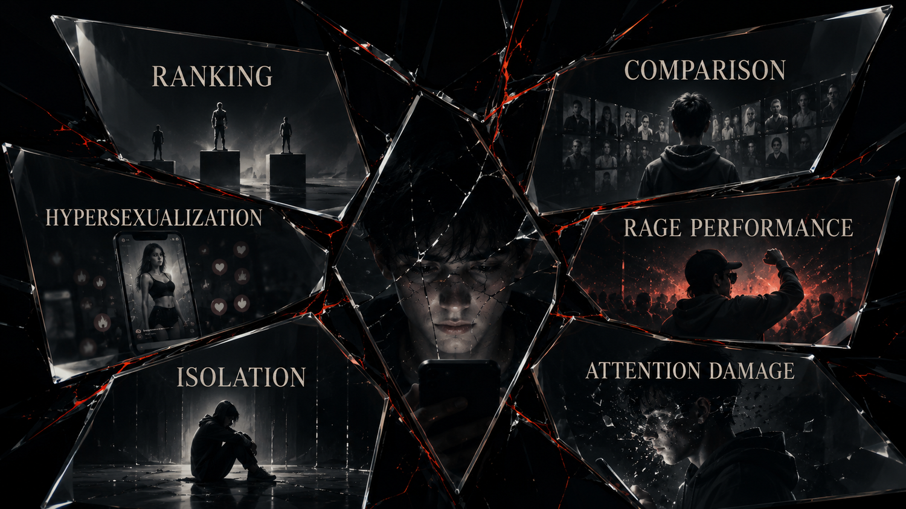

## Opening

We thought we were posting.

We were confessing.

We thought we were performing.

We were being measured.

We thought the feed was showing us the world.

The feed was teaching us which versions of ourselves would survive inside it.

That last part matters because the deepest damage of the social era was never just “too much screen time.” That phrase is way too soft. It sounds like a lifestyle imbalance. What happened was closer to social programming through ranked exposure. Not total programming. Not mind control. Something more ordinary and therefore more powerful: repeated incentives shaping what feels desirable, embarrassing, lovable, aspirational, punishable, and real.

## Main Narrative

The algorithm did not invent insecurity. It industrialized it.

It did not invent vanity. It scaled it.

It did not invent loneliness. It learned how to monetize the gestures people make when they are lonely.

This chapter is the emotional center of the first half of the book because it gets closest to what readers already know in their bodies. Brain fog. Comparison fatigue. Pornified aesthetics. Performance pressure. Main-character exhaustion. The weird feeling that even private life started sounding like content strategy. The sense that your attention got cooked years before anyone around you had language for what was happening.

That doesn’t mean every wound in a generation can be pinned on social media alone. That would be lazy and inaccurate. Economic precarity matters. Housing pressure matters. Family instability matters. School systems matter. The pandemic matters. Labor anxiety matters. But the platform layer acted like an amplifier for all of it. It made insecurity ambient, portable, and endlessly replayable.

That is the structural point.

The algorithm did not need to create every human weakness.

It only had to discover which arrangements of weakness kept people watching.

{ width=92% }

That is why the cultural symptoms feel so familiar and so hard to summarize at the same time. Hypersexualization becomes ordinary not because desire is new, but because desire stripped into high-velocity attention bait performs extremely well in ranking systems. Gangster aesthetics become sticky not because violence is glamorous in some eternal abstract sense, but because dominance, danger, and spectacle are easy to package as scroll-stopping identity. Digital prostitution aesthetics get normalized not because an entire generation woke up with one shared moral collapse, but because the feed rewards monetized intimacy and teaches users that visibility itself is survival.

The point here is not prudishness.

The point is incentive design.

The feed is not a neutral mirror reflecting culture back to itself. It is an active ranking machine. It learns which emotions, fantasies, humiliations, and social performances produce retention. Then it keeps handing society more of what holds attention, even when what holds attention also corrodes trust, stillness, self-respect, and judgment.

That is how a moral environment changes without anyone officially voting to change it.

{ width=100% }

This is also where the chapter has to be careful without going soft. When this book talks about hypersexualization, prostitution aesthetics, or gangster fantasy, it is not doing suburban pearl-clutching. It is describing what happens when a ranking environment learns that certain performances of body, power, danger, and humiliation convert beautifully into attention. The algorithm did not force one single culture on everyone. It rewarded the most extractable versions of culture. And over time, the rewarded version starts looking like the normal version, especially to kids whose social imagination was built inside the machine.

That is why so many young people learned an awful lesson early: if you want reach, flatten yourself into a stronger signal. Be hotter. Be meaner. Be more available. Be more shameless. Be more watchable. Be more broken in a way the app can aestheticize. Even authenticity starts mutating under those conditions. The confession is no longer only a confession. It is content pressure wearing the face of vulnerability. The cry for connection gets mixed with performance because the system keeps blurring the line between being seen and being fed into the next ranking cycle.

A lot of people can feel this but still don’t have a stable sentence for it. They remember the before-and-after, even if the before is blurry now. Before, some things still lived in distinct rooms: friendship, embarrassment, flirting, gossip, aspiration, erotic life, boredom, play. After enough years in the feed, those rooms began to collapse into one another. Friendship became performance. Flirting became metrics. Embarrassment became content. Boredom became danger because boredom meant silence, and silence meant the feed might stop reflecting you back.

That is one reason the psychological cost is so hard to explain to older frameworks. A lot of adults still want to talk about “bad influences” as if the problem were mainly a set of wrong examples floating through media. The platform era is more invasive than that. It changes the rate at which identity is processed. It turns social life into constant audience awareness. It makes ranking feel atmospheric. It trains people to anticipate visibility the way earlier generations anticipated weather.

And once that happens, the self gets tired in a new way.

Not just emotionally tired.

Context-switching tired.

Comparison tired.

Perform-or-vanish tired.

Always-legible tired.

That is why attention collapse belongs in this chapter as more than a medical symptom. Yes, clinicians can and should talk about anxiety, depression, compulsive use, and dysregulation in their own terms. But this book is making an additional claim: mental-health decline is also an infrastructure story. If a society places its youngest generations inside systems engineered to interrupt stillness, weaponize comparison, and reward arousal over reflection, then some portion of the resulting distress is not a mysterious generational flaw. It is an operational cost of the architecture.

That is a brutal sentence, but it is also clarifying.

Because generations that are constantly told they are fragile, lazy, addicted, narcissistic, unserious, oversexualized, depoliticized, hyperanxious, and unable to focus end up carrying a double burden. They live inside the damage and then get blamed for not transcending it individually.

The book rejects that move.

The claim here is not that young people are saints ruined by screens.

The claim is that vulnerability was systematized.

Fragility was industrialized.

Loneliness was monetized.

Status panic was optimized.

And then the generation most shaped by that process was mocked for looking shaped.

This also helps explain why so many people feel ashamed of their own habits while still returning to the systems that produce them. Dependency in a technofeudal system is not just habit. It is social necessity braided to emotional reward and punishment. Leaving the platform or reducing dependence can feel like self-respect, but it can also feel like disappearance. That tension is one reason shame becomes such a powerful internal manager of behavior.

You know the app is bad for you.

You go back anyway.

You hate that you go back.

The shame makes you want stimulation.

The stimulation lives in the same app.

Now the loop manages itself.

That is not moral weakness in the shallow sense. It is behavioral design meeting ordinary human vulnerability.

And the violence is not only psychological. It is temporal. It steals incubation. It steals the long awkward stretch in which a self used to form a little more privately. Previous generations still had mirrors, peer pressure, porn, status games, and cruelty. None of that began with the phone. What changed is that the pressure became ambient, searchable, replayable, and portable into the bed, the bathroom, the lunch table, the walk home, the classroom, the family trip, the funeral, the sleepless night. There is almost no private weather left in a life fully raised by the feed.

The chapter also needs to say something careful about youth because the differences between millennials and Gen Z matter. Millennials remember a before. Not a pure before, not a perfect before, but a before in which digital life had not yet swallowed everything. Gen Z, especially younger Gen Z, was raised much more directly inside the platform-conditioned world. For many, the feed was not an adoption story. It was childhood weather. Their adolescence happened in public/private systems that already knew how to rank faces, bodies, affiliations, jokes, aesthetics, and emotional signals.

That is a profound developmental difference.

The child in a technofeudal order is not merely a future consumer.

The child is a native subject of the territory.

This is why the reforms at the end of the book have to reach beyond moderation discourse. “Better content policy” does not begin to meet the scale of what is being described here. The problem is not just a bad post. It is a ranking environment that shapes the conditions under which identity formation happens. Once you understand that, legal passivity starts looking ridiculous. A platform that governs exposure, arousal, and adolescent social reality at mass scale cannot keep hiding behind the fiction that it merely hosts whatever people happen to upload.

It builds the social weather.

And the weather has consequences.

## Research Notes

This chapter adapts the documentary argument developed in the research paper **Chapter 02: Social Erosion and Moral Reconfiguration**. That paper ties youth harm, recommendation amplification, attention damage, and moral reconfiguration back to platform design rather than to simplistic civilizational decline stories.

Scan this QR code to open the live research paper with the full documentary basis, citations, and supporting links.

{ width=34% }

Fallback URL: [hassanvfx.github.io/ai-empire/papers/html/02_social-erosion-and-moral-reconfiguration_paper.html](https://hassanvfx.github.io/ai-empire/papers/html/02_social-erosion-and-moral-reconfiguration_paper.html)
