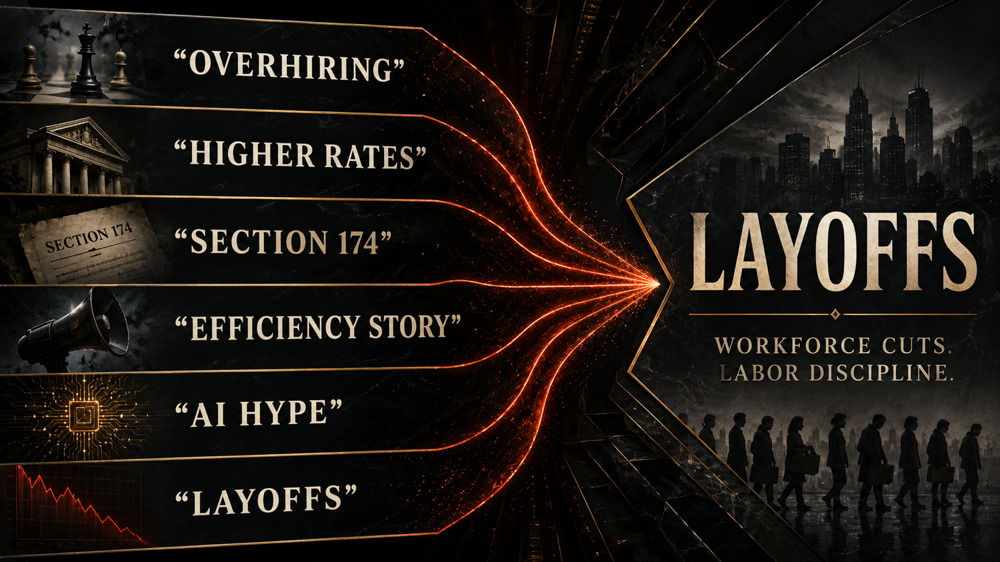

## Opening

The same industry that spent years treating elite technical workers like golden blood suddenly found a very different vocabulary for them the moment the market tightened.

Not builders.

Headcount.

Not talent.

Cost centers.

Not the future.

Excess.

Not family.

A line item.

If you worked in or around tech during that shift, you could feel the betrayal almost before you could explain it. The vibes changed first. Then the language changed. Then the org charts changed. Then people disappeared.

One week it was founder talk, mission talk, future talk. The next week it was nervous Slack threads, recruiter rumors, vague calendar holds, and the weird quiet that hits an office when everybody already knows the spreadsheet has started deciding who counts.

## Main Narrative

One of the cleanest lies of the AI era is that the layoffs were simple proof that the machines had already made people obsolete. It is a neat story, which is exactly why capital liked it. But the documentary record is messier than that, and the mess is the point.

The correction was already forming.

Post-pandemic overhiring mattered.

Interest-rate pressure mattered.

Margin anxiety mattered.

Investor demands mattered.

Tax treatment changes such as Section 174 mattered.

The entire vibe shift from growth worship to efficiency worship mattered.

AI did not create all of that from zero.

AI gave it a sacred language.

That language was wildly useful because it turned a financial and strategic correction into a civilizational necessity. Once executives could say “we are reorganizing for the AI future,” the cuts started sounding visionary instead of extractive. Once a company could claim it was flattening teams, driving efficiency, or reallocating toward intelligence infrastructure, the human cost was wrapped in inevitability language.

That is why the word ritual fits. A ritual is not just an event. It is an event arranged to teach everyone something. The layoff wave taught workers several lessons at once.

First: your talent is celebrated when growth needs your aura.

Second: your security evaporates when the macro story changes.

Third: a machine trained partly on the digital world you helped build can be invoked rhetorically against you whether or not it has literally replaced you in any clean technical sense.

That third lesson is one of the ugliest in the whole book. The same ecosystem that harvested human labor, open knowledge, collective code, and community-built expertise suddenly discovered the strategic value of telling workers that their bargaining position had weakened because intelligence itself was being automated. Sometimes there was a real productivity shift underneath that claim. Often there was also narrative theater doing a lot of heavy lifting.

The theater matters because it disciplines the surviving workforce even when no full replacement has happened yet. If everyone around you is being told that AI is the next productivity baseline, then the meaning of your own labor changes even before your job does. You are expected to output more, faster, with fewer people, while the company claims it is simply adapting to the future.

That does something to worker psychology.

It narrows negotiation.

It weakens solidarity.

It makes resistance feel old-fashioned.

It makes management sound like history itself.

And because so many younger workers had been taught to treat tech not just as employment but as identity, the hit landed deeper than a normal recession story. The industry had sold a whole emotional package with the paycheck: the mission, the campus, the perks, the myth that shipping fast meant living at the frontier. Then the frontier started talking back in cost-accounting language.

And because so much of the sector spent years mythologizing technical labor as the engine of everything, the reversal hit with a particularly disorienting force. Engineers were not only employees in this story. They were social symbols. They were the proof that the future had prestige, that software had winners, that intelligence still had upward mobility attached to it. Then, when the correction arrived, the symbolism snapped.

Suddenly the worker was not the future.

The worker was drag on margin.

That is not the whole story, of course. Some firms were genuinely bloated. Some teams were real duplicates. Some pandemic-era hiring waves were unsustainable in obvious ways. The point of this chapter is not to romanticize every role or deny that labor markets swing. The point is to stop accepting the flattering lie that the cuts can be fully explained as purely technical progress.

They cannot.

Part of what made the story so effective was that it contained enough truth to move fast. Yes, some automation tools were improving. Yes, some companies had hired like zero-rate euphoria would last forever. Yes, some orgs were padded. But that is exactly why the narrative worked: it compressed multiple causes into one clean moral signal. The future belongs to leaner firms and machine-assisted output, so anyone questioning the cuts can be framed as arguing with reality itself.

The causal picture is layered:

financial correction,

tax treatment pressure,

capital-market discipline,

post-pandemic normalization,

efficiency language,

and then AI as legitimizing narrative layered on top.

That layered explanation is more uncomfortable than the simple one because it reveals how power works in grown-up markets. The machine does not need to fully replace the worker to lower the worker’s leverage. It only needs to become believable enough as a management story.

{ width=92% }

This is also where Section 174 matters in a way normal public discourse almost never explains well. The rule change did not magically cause every layoff by itself, and pretending it did would be sloppy. But it did change how software and research spending hit the books, which matters in a sector addicted to growth optics and investor signaling. If labor once looked like expansion, parts of that same labor could suddenly look like a cleaner thing to rationalize, defer, or cut. In plain English: accounting pressure met macro pressure, then got narrated through efficiency language that was unusually easy to fuse with AI hype.

And when that fusion happened, workers were asked to internalize the logic as common sense. Be grateful you are still here. Learn the tools faster. Ship more with less. Treat the shrinking team as proof of strategic maturity. Pretend the sprint did not just become a slow emergency. A whole generation of technical workers got a brutal education in how quickly “the future” turns on labor once capital decides the valuation story needs a new costume.

That is the real weaponization of inevitability.

The machine becomes an alibi before it becomes a total substitute.

{ width=100% }

And for middle-class technical workers, that alibi is politically important because it shows how quickly a sector can move from talent hoarding to labor disciplining once valuation logic changes. Companies do not only hire because they need the exact current output. Sometimes they hire to capture strategic labor, defend market position, signal momentum, and build the story that justifies extraordinary valuation. When that story changes, the same surplus labor that once inflated prestige becomes the easiest thing to cut.

Workers experience the fall emotionally.

Finance experiences it narratively.

AI helped close that gap.

It let boards, executives, and markets say: this is not simply retrenchment. This is modernization.

That word did serious ideological work. Modernization sounds clean. Mature. Inevitable. Like no one made a choice and history just showed up with a knife. But what many workers actually lived through felt less like elegant modernization and more like class discipline in premium branding: fewer people, more output, more pressure, more internal AI mandates, more expectation that one person should now carry what used to be one-and-a-half jobs.

That claim will keep showing up unless readers learn how to hear it properly.

Modernization for whom?

Efficiency for whom?

Productivity against which denominator?

Innovation at whose cost?

When a firm that benefited from a decade of elite technical labor suddenly starts talking like labor itself is a transitional inconvenience, that is not just strategy. It is class reordering under high-status language.

That matters because the future of AI is not only a story about consumers and creators. It is also a story about the technical middle class. The people who built systems, shipped products, made infrastructure legible, staffed teams, documented knowledge, trained juniors, and held together modern software organizations are being told in real time that the very abstraction layer built from collective digital life now justifies doing more with less.

The insult is historic.

But it is also clarifying.

It reveals where ownership sits.

It also reveals the labor logic of technofeudalism. The serf matters until the lord finds a lower-friction way to extract the harvest. In the digital version, elite labor is praised while it is scarce, strategic, and valuation-friendly. Then, once enough code, enough process, enough documentation, and enough machine leverage accumulate, the same labor is told to accept weaker security in the name of progress. That is not a glitch in the story. It is the story.

For readers outside tech, this chapter matters because the pattern does not stay inside engineering orgs. It leaks outward into copywriting, design, support, teaching, analysis, journalism, legal prep, translation, and all the middle layers of knowledge work. The prestige version shows up first in software because software had the capital and the mythology. The discipline mechanism spreads later. What gets tested on engineers today gets marketed to everyone else tomorrow as the responsible way to live with AI.

## Research Notes

This chapter adapts the documentary argument developed in the research paper **Chapter 05: Talent, Overhiring, Valuation, and Layoffs**. That paper ties labor correction to financial structure, Section 174, post-pandemic excess, company efficiency language, and the strategic use of AI rhetoric.

Scan this QR code to open the live research paper with the full documentary basis, citations, and supporting links.

{ width=34% }

Fallback URL: [hassanvfx.github.io/ai-empire/papers/html/05_talent-overhiring-layoffs_paper.html](https://hassanvfx.github.io/ai-empire/papers/html/05_talent-overhiring-layoffs_paper.html)
