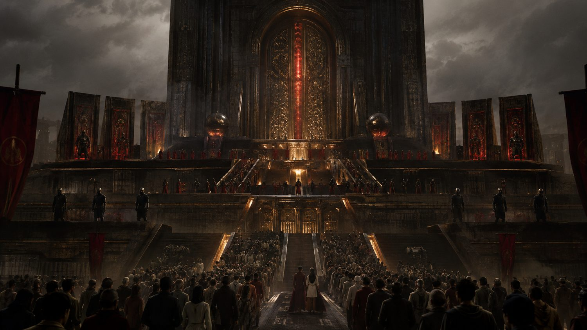
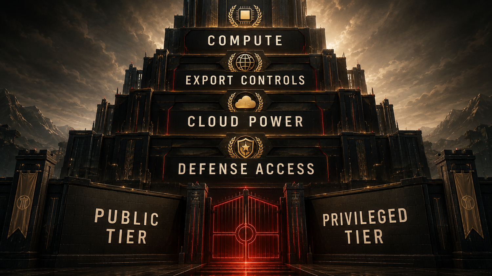

## Opening

In the old empire, power wanted the ports, the roads, the steel, the trade routes, the army, the sea lanes, the oil.

In this one, power still wants plenty of that.

But now it also wants the chips, the cloud, the compute clusters, the export controls, the model endpoints, the government-only environments, the defense channels, and the right to decide who gets close to advanced intelligence and on what terms.

That is the moment when AI stops looking like a fun product category and starts looking like strategic territory.

```{=typst}
#pagebreak()
```

## Main Narrative

A lot of public conversation about AI is still stuck at the consumer layer. Which chatbot is faster. Which model is cheaper. Which app summarized your meeting. Which assistant vibes more human. That layer matters because it shapes habit, but it can also hide the harder truth: consumer access is not the same thing as power.

The easiest way to say it is this: getting a freemium balcony seat is not the same as holding the keys to the theater. A public interface can be massively popular and still leave the real leverage somewhere far above the crowd, in rooms most users will never see and cannot vote on.

You can hand millions of people a public interface and still reserve the meaningful leverage somewhere else entirely.

That somewhere else is the gate.

The gate is made of compute concentration.

The gate is made of cloud dependence.

The gate is made of export-control politics.

The gate is made of government contracts.

The gate is made of who gets a frontier deployment, who gets a sovereign environment, who gets inside the policy room, who gets the classified variant, who gets to help define “safe” access, and who gets told that a friendly consumer product is close enough to participation.

This is where the word imperial stops sounding melodramatic and starts sounding descriptive. We are no longer dealing only with open competition among ordinary software vendors. We are dealing with an ecosystem where the ability to approach the most powerful systems is increasingly filtered through chokepoints that are technical, financial, political, and geopolitical all at once.

Some firms own or control key model layers.

Some cloud giants control distribution terrain.

Some governments control licensing, export, and security framing.

Some defense channels create privileged operational pathways.

And everyone below that stack is encouraged to believe that broad consumer exposure equals democratic access.

It doesn’t.

That is one of the defining illusions of the whole era.

If a consumer gets a model in their browser while states, defense structures, hyperscalers, and a tiny number of frontier firms sit at the level where strategic access is decided, then the public has interface access, not sovereignty.

That distinction matters because intelligence is becoming infrastructure. Not total infrastructure, not the only thing that matters, but a genuine layer of future coordination, labor, administration, and competitive advantage. If that layer is tiered, governed, and selectively distributed, then the politics of access become as important as the politics of invention.

That is where the chapter stops sounding like product criticism and starts sounding like geopolitical realism. Once intelligence becomes tiered infrastructure, the central question is no longer just who invented what first. It becomes who can deny access, who can create privileged lanes, who can call an emergency and get special treatment, who can integrate at scale, and who is expected to stay grateful for whatever version reaches the public tier.

{ width=92% }

The language around safety often gets weirdly useful here. Safety can be a real concern. It can also become a sorting mechanism. Strategic risk can justify genuine caution. It can also rationalize privileged control. Export controls can reflect real geopolitical competition. They can also crystallize the fact that frontier AI is already being treated not as ordinary consumer software but as a strategic resource whose circulation must be managed.

That is the core turn this chapter wants the reader to feel.

The “AI boom” is not just a market.

It is a border regime in the making.

Some people will get mass-market access.

Some institutions will get premium proximity.

Some companies will get infrastructure intimacy.

Some states will get strategic channels.

Some populations will supply the substrate while staying far from the control layer.

Once you see that, a lot of the rhetoric around openness starts sounding like branding for a staircase.

You get the lower steps. You get the demo, the endpoint, the API tier, the sense that you are close enough to the miracle to count as included. Meanwhile the upper levels, where compute allocation, sovereign environments, export permissions, and security-framed deployment choices are made, remain heavily guarded and thinly democratized.

One of the traps here is to jump immediately into hidden-mastermind storytelling. The stronger case does not need it. The formal record is already loud enough. Compute concentration is real. State-company coordination is real. Defense offerings are real. Export control is real. Government-only deployment pathways are real. Cloud dependency is real. None of that proves omnipotence. It proves hierarchy.

And hierarchy is enough.

Hierarchy is enough to reshape research tempo, state capacity, labor markets, and international dependency. It is enough to determine which countries buy power and which rent it, which institutions build competence and which lease it, which publics can audit systems and which are expected to clap from the outside.

```{=typst}
#pagebreak()
```

{ width=100% }

This is also where the moral stakes of access become visible in everyday terms. If advanced models increasingly mediate productivity, research acceleration, coding assistance, bureaucratic throughput, and strategic planning, then unequal access to those layers can compound preexisting inequality fast. The gap is no longer just money or education in the old sense. It becomes mediated intelligence proximity.

Who gets the best tools?

Who gets the fastest inference?

Who gets the safest hosting?

Who gets the deployment environment with the fewest restrictions?

Who gets to fine-tune at scale?

Who gets to shape the rules everyone else must accept?

The answer, unless the structure is contested, will not be “everyone.”

And that is why the anti-capture reform at the end of this book matters so much. If AI firms benefit from public contracts, strategic access, national-security intimacy, subsidy-like advantage, or privileged state alignment, then their obligations cannot remain private-company-light while their leverage becomes civilization-scale. A firm this close to the gate of intelligence cannot keep pretending it owes the public nothing except product polish and a trust-me blog post.

This chapter is not about hating innovation. It is about refusing the fairy tale that the frontier is a neutral commons just because a public demo exists. Empires love demos. Demos keep the crowd impressed while the fortifications harden somewhere else.

So yes, use the public interface if you want. Study it. Learn it. Critique it. Build around it when necessary. But do not confuse being let into the gift shop with being allowed near the control room.

That confusion is how a hierarchy normalizes itself.

And once it normalizes, the next move is predictable: the winners stop sounding like vendors and start sounding like custodians of destiny. That is where the story goes next, because raw concentration is unstable until elite society decides to praise it.

## Research Notes

This chapter adapts the documentary argument developed in the research paper **Chapter 07: Imperial Control Over Access**. That paper grounds the access story in compute chokepoints, government offerings, defense channels, export-control politics, and documented state-company interfaces.

Scan this QR code to open the live research paper with the full documentary basis, citations, and supporting links.

{ width=34% }

Fallback URL: [hassanvfx.github.io/ai-empire/papers/html/07_imperial-control-over-access_paper.html](https://hassanvfx.github.io/ai-empire/papers/html/07_imperial-control-over-access_paper.html)
